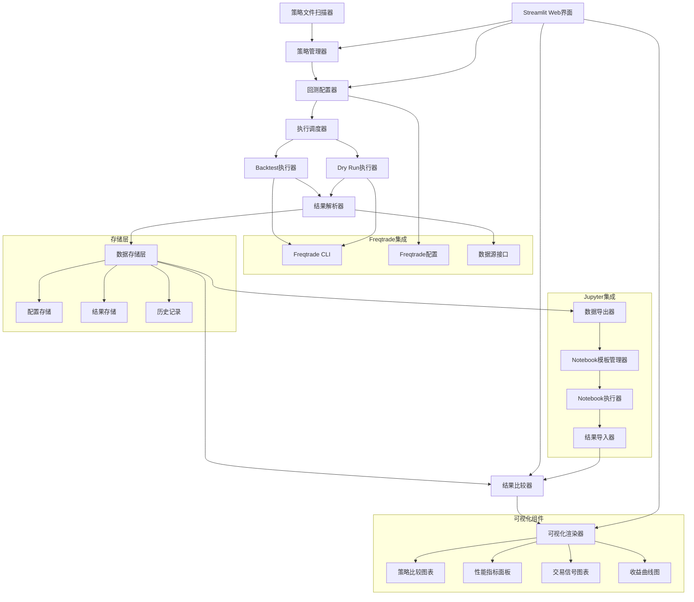

# 设计文档

## 概述

本项目设计一个基于Streamlit的freqtrade策略回测系统，支持多策略并行回测、dry run模式、结果比较分析和可视化展示。系统采用模块化架构，确保代码结构清晰、易于维护和扩展。

核心功能包括：
- 策略自动发现和选择
- 多策略并行回测执行
- 实时dry run监控
- 回测结果比较和可视化
- 配置管理和历史记录
- 与strategy_visualizer的集成预留

## 架构

### 系统架构图



### 技术栈选择

**主要框架：**
- **Streamlit** - Python Web应用框架
  - 纯Python开发，快速原型
  - 内置状态管理和组件
  - 支持实时数据更新
  - 易于部署和维护

**UI/UX设计：**
- **streamlit-elements** - 高级UI组件库
- **streamlit-aggrid** - 高性能数据表格
- **streamlit-option-menu** - 美观的导航菜单
- **custom CSS** - 自定义样式和主题

**数据处理：**
- **pandas** - 数据处理和分析
- **numpy** - 数值计算
- **concurrent.futures** - 并行执行管理

**可视化：**
- **plotly** - 交互式图表库
  - 支持多种图表类型
  - 良好的Streamlit集成
  - 支持实时数据更新

**Freqtrade集成：**
- **subprocess** - 调用freqtrade CLI
- **json** - 配置文件处理
- **pathlib** - 文件路径管理

**存储：**
- **sqlite3** - 轻量级数据库
- **json** - 配置文件存储
- **pickle** - 对象序列化

**Jupyter集成：**
- **jupyter** - Notebook服务器
- **nbformat** - Notebook文件处理
- **papermill** - Notebook参数化执行

## 组件和接口

### 1. 策略管理组件

#### 1.1 策略扫描器

```python
# components/strategy_manager/scanner.py
class StrategyScanner:
    def __init__(self, base_path: str = "."):
        self.base_path = Path(base_path)
        self.strategy_patterns = ["*.py"]
    
    def scan_strategies(self) -> List[StrategyInfo]:
        """扫描并识别策略文件"""
        strategies = []
        for pattern in self.strategy_patterns:
            for file_path in self.base_path.rglob(pattern):
                if self._is_strategy_file(file_path):
                    strategy_info = self._extract_strategy_info(file_path)
                    if strategy_info:
                        strategies.append(strategy_info)
        return strategies
    
    def _is_strategy_file(self, file_path: Path) -> bool:
        """检查文件是否为策略文件"""
        try:
            with open(file_path, 'r', encoding='utf-8') as f:
                content = f.read()
                return 'IStrategy' in content and 'class' in content
        except Exception:
            return False
    
    def _extract_strategy_info(self, file_path: Path) -> Optional[StrategyInfo]:
        """提取策略基本信息"""
        # 解析策略文件，提取类名、描述等信息
        pass
```

#### 1.2 策略选择器

```python
# components/strategy_manager/selector.py
class StrategySelector:
    def render_strategy_selection(self, strategies: List[StrategyInfo]) -> List[str]:
        """渲染策略选择界面"""
        st.subheader("📋 策略选择")
        
        # 全选/全不选
        col1, col2 = st.columns([1, 4])
        with col1:
            select_all = st.checkbox("全选")
        
        # 策略列表
        selected_strategies = []
        for strategy in strategies:
            if st.checkbox(
                f"{strategy.name} - {strategy.description[:50]}...",
                value=select_all,
                key=f"strategy_{strategy.name}"
            ):
                selected_strategies.append(strategy.name)
        
        return selected_strategies
```

### 2. 回测配置组件

#### 2.1 配置面板

```python
# components/backtest_config/panel.py
class BacktestConfigPanel:
    def render_config_panel(self) -> BacktestConfig:
        """渲染回测配置面板"""
        st.subheader("⚙️ 回测配置")
        
        with st.expander("基本配置", expanded=True):
            col1, col2, col3 = st.columns(3)
            
            with col1:
                start_date = st.date_input("开始日期", 
                    datetime.now() - timedelta(days=30))
                timeframe = st.selectbox("时间框架", 
                    ["5m", "15m", "1h", "4h", "1d"])
            
            with col2:
                end_date = st.date_input("结束日期", datetime.now())
                pairs = st.multiselect("交易对", 
                    ["BTC/USDT", "ETH/USDT", "ADA/USDT"], 
                    default=["BTC/USDT"])
            
            with col3:
                initial_balance = st.number_input("初始资金", value=1000.0)
                max_open_trades = st.number_input("最大持仓", value=3)
        
        with st.expander("高级配置"):
            fee = st.number_input("手续费率", value=0.001, format="%.4f")
            enable_position_stacking = st.checkbox("启用仓位叠加")
            stake_amount = st.selectbox("下注金额", 
                ["unlimited", "10", "50", "100"])
        
        return BacktestConfig(
            start_date=start_date,
            end_date=end_date,
            timeframe=timeframe,
            pairs=pairs,
            initial_balance=initial_balance,
            max_open_trades=max_open_trades,
            fee=fee,
            enable_position_stacking=enable_position_stacking,
            stake_amount=stake_amount
        )
```

#### 2.2 配置管理器

```python
# components/backtest_config/manager.py
class ConfigManager:
    def __init__(self, config_dir: str = "configs"):
        self.config_dir = Path(config_dir)
        self.config_dir.mkdir(exist_ok=True)
    
    def save_config(self, config: BacktestConfig, name: str):
        """保存配置到文件"""
        config_file = self.config_dir / f"{name}.json"
        with open(config_file, 'w') as f:
            json.dump(config.to_dict(), f, indent=2, default=str)
    
    def load_config(self, name: str) -> Optional[BacktestConfig]:
        """从文件加载配置"""
        config_file = self.config_dir / f"{name}.json"
        if config_file.exists():
            with open(config_file, 'r') as f:
                data = json.load(f)
                return BacktestConfig.from_dict(data)
        return None
    
    def list_configs(self) -> List[str]:
        """列出所有保存的配置"""
        return [f.stem for f in self.config_dir.glob("*.json")]
```

### 3. 执行调度组件

#### 3.1 并行执行器

```python
# components/execution/scheduler.py
class ExecutionScheduler:
    def __init__(self, max_workers: int = 4):
        self.max_workers = max_workers
        self.executor = ThreadPoolExecutor(max_workers=max_workers)
        self.running_tasks = {}
    
    def execute_backtest_batch(self, strategies: List[str], 
                              config: BacktestConfig) -> Dict[str, Future]:
        """批量执行回测"""
        futures = {}
        for strategy in strategies:
            future = self.executor.submit(
                self._execute_single_backtest, strategy, config
            )
            futures[strategy] = future
            self.running_tasks[strategy] = future
        
        return futures
    
    def _execute_single_backtest(self, strategy: str, 
                                config: BacktestConfig) -> BacktestResult:
        """执行单个策略回测"""
        # 创建临时配置文件
        temp_config = self._create_temp_config(strategy, config)
        
        # 构建freqtrade命令
        cmd = [
            "freqtrade", "backtesting",
            "--config", temp_config,
            "--strategy", strategy,
            "--timeframe", config.timeframe,
            "--timerange", f"{config.start_date.strftime('%Y%m%d')}-{config.end_date.strftime('%Y%m%d')}",
            "--export", "trades"
        ]
        
        # 执行命令
        result = subprocess.run(cmd, capture_output=True, text=True)
        
        if result.returncode == 0:
            return self._parse_backtest_result(result.stdout, strategy, config)
        else:
            raise Exception(f"Backtest failed: {result.stderr}")
    
    def get_execution_status(self) -> Dict[str, str]:
        """获取执行状态"""
        status = {}
        for strategy, future in self.running_tasks.items():
            if future.done():
                if future.exception():
                    status[strategy] = "failed"
                else:
                    status[strategy] = "completed"
            else:
                status[strategy] = "running"
        return status
```

#### 3.2 Dry Run执行器

```python
# components/execution/dry_run.py
class DryRunExecutor:
    def __init__(self):
        self.running_processes = {}
        self.stop_events = {}
    
    def start_dry_run(self, strategy: str, config: BacktestConfig) -> str:
        """启动dry run"""
        run_id = f"{strategy}_{datetime.now().strftime('%Y%m%d_%H%M%S')}"
        
        # 创建停止事件
        stop_event = threading.Event()
        self.stop_events[run_id] = stop_event
        
        # 启动dry run线程
        thread = threading.Thread(
            target=self._run_dry_run,
            args=(strategy, config, run_id, stop_event)
        )
        thread.start()
        
        self.running_processes[run_id] = {
            'strategy': strategy,
            'thread': thread,
            'start_time': datetime.now(),
            'status': 'running'
        }
        
        return run_id
    
    def stop_dry_run(self, run_id: str):
        """停止dry run"""
        if run_id in self.stop_events:
            self.stop_events[run_id].set()
            self.running_processes[run_id]['status'] = 'stopping'
    
    def _run_dry_run(self, strategy: str, config: BacktestConfig, 
                     run_id: str, stop_event: threading.Event):
        """执行dry run"""
        temp_config = self._create_temp_config(strategy, config)
        
        cmd = [
            "freqtrade", "trade",
            "--config", temp_config,
            "--strategy", strategy,
            "--dry-run"
        ]
        
        process = subprocess.Popen(
            cmd, stdout=subprocess.PIPE, stderr=subprocess.PIPE, text=True
        )
        
        while not stop_event.is_set():
            output = process.stdout.readline()
            if output:
                self._process_dry_run_output(run_id, output)
            
            if process.poll() is not None:
                break
            
            time.sleep(1)
        
        process.terminate()
        self.running_processes[run_id]['status'] = 'stopped'
```

### 4. 结果处理组件

#### 4.1 结果解析器

```python
# components/results/parser.py
class ResultParser:
    def parse_backtest_output(self, output: str, strategy: str, 
                             config: BacktestConfig) -> BacktestResult:
        """解析freqtrade回测输出"""
        # 解析性能指标
        metrics = self._extract_metrics(output)
        
        # 解析交易记录
        trades = self._extract_trades(output)
        
        # 构建结果对象
        return BacktestResult(
            strategy_name=strategy,
            config=config,
            metrics=metrics,
            trades=trades,
            timestamp=datetime.now()
        )
    
    def _extract_metrics(self, output: str) -> Dict[str, float]:
        """提取性能指标"""
        metrics = {}
        
        # 使用正则表达式提取关键指标
        patterns = {
            'total_return': r'Total profit\s+([+-]?\d+\.?\d*)',
            'win_rate': r'Win rate\s+(\d+\.?\d*)%',
            'max_drawdown': r'Max Drawdown\s+([+-]?\d+\.?\d*)%',
            'sharpe_ratio': r'Sharpe\s+([+-]?\d+\.?\d*)',
            'total_trades': r'Total trades\s+(\d+)'
        }
        
        for key, pattern in patterns.items():
            match = re.search(pattern, output)
            if match:
                metrics[key] = float(match.group(1))
        
        return metrics
    
    def _extract_trades(self, output: str) -> List[Dict]:
        """提取交易记录"""
        # 解析交易详情
        # 这里需要根据freqtrade的实际输出格式进行解析
        pass
```

#### 4.2 结果比较器

```python
# components/results/comparator.py
class ResultComparator:
    def compare_strategies(self, results: List[BacktestResult]) -> ComparisonResult:
        """比较多个策略结果"""
        comparison_data = []
        
        for result in results:
            comparison_data.append({
                'strategy': result.strategy_name,
                'total_return': result.metrics.get('total_return', 0),
                'win_rate': result.metrics.get('win_rate', 0),
                'max_drawdown': result.metrics.get('max_drawdown', 0),
                'sharpe_ratio': result.metrics.get('sharpe_ratio', 0),
                'total_trades': result.metrics.get('total_trades', 0)
            })
        
        df = pd.DataFrame(comparison_data)
        
        return ComparisonResult(
            data=df,
            best_strategy=self._find_best_strategy(df),
            rankings=self._calculate_rankings(df)
        )
    
    def _find_best_strategy(self, df: pd.DataFrame) -> str:
        """找出最佳策略"""
        # 基于综合评分找出最佳策略
        df['score'] = (
            df['total_return'] * 0.4 +
            df['win_rate'] * 0.3 +
            (100 - abs(df['max_drawdown'])) * 0.2 +
            df['sharpe_ratio'] * 0.1
        )
        return df.loc[df['score'].idxmax(), 'strategy']
```

### 5. Jupyter Notebook集成组件

#### 5.1 Notebook模板管理器

```python
# components/jupyter_integration/template_manager.py
class NotebookTemplateManager:
    def __init__(self, templates_dir: str = "notebook_templates"):
        self.templates_dir = Path(templates_dir)
        self.templates_dir.mkdir(exist_ok=True)
        self._create_default_templates()
    
    def _create_default_templates(self):
        """创建默认分析模板"""
        templates = {
            "basic_analysis.ipynb": self._create_basic_analysis_template(),
            "advanced_metrics.ipynb": self._create_advanced_metrics_template(),
            "strategy_comparison.ipynb": self._create_comparison_template(),
            "risk_analysis.ipynb": self._create_risk_analysis_template()
        }
        
        for name, template in templates.items():
            template_path = self.templates_dir / name
            if not template_path.exists():
                with open(template_path, 'w') as f:
                    json.dump(template, f, indent=2)
    
    def _create_basic_analysis_template(self) -> Dict:
        """创建基础分析模板"""
        return {
            "cells": [
                {
                    "cell_type": "markdown",
                    "source": ["# 策略回测结果分析\n\n本notebook用于分析freqtrade策略回测结果"]
                },
                {
                    "cell_type": "code",
                    "source": [
                        "import pandas as pd\n",
                        "import numpy as np\n",
                        "import matplotlib.pyplot as plt\n",
                        "import seaborn as sns\n",
                        "from pathlib import Path\n",
                        "\n",
                        "# 加载回测结果数据\n",
                        "# 参数将通过papermill注入\n",
                        "result_file = r'{{ result_file }}'\n",
                        "strategy_name = '{{ strategy_name }}'\n",
                        "\n",
                        "print(f'分析策略: {strategy_name}')\n",
                        "print(f'数据文件: {result_file}')"
                    ]
                },
                {
                    "cell_type": "code",
                    "source": [
                        "# 加载数据\n",
                        "import pickle\n",
                        "with open(result_file, 'rb') as f:\n",
                        "    backtest_result = pickle.load(f)\n",
                        "\n",
                        "print('回测结果概览:')\n",
                        "print(f'策略名称: {backtest_result.strategy_name}')\n",
                        "print(f'回测时间: {backtest_result.timestamp}')\n",
                        "print(f'交易次数: {len(backtest_result.trades)}')"
                    ]
                }
            ],
            "metadata": {
                "kernelspec": {
                    "display_name": "Python 3",
                    "language": "python",
                    "name": "python3"
                }
            },
            "nbformat": 4,
            "nbformat_minor": 4
        }
    
    def get_available_templates(self) -> List[str]:
        """获取可用模板列表"""
        return [f.stem for f in self.templates_dir.glob("*.ipynb")]
```

#### 5.2 数据导出器

```python
# components/jupyter_integration/data_exporter.py
class DataExporter:
    def __init__(self, export_dir: str = "jupyter_exports"):
        self.export_dir = Path(export_dir)
        self.export_dir.mkdir(exist_ok=True)
    
    def export_backtest_result(self, result: BacktestResult) -> str:
        """导出回测结果供Jupyter使用"""
        timestamp = datetime.now().strftime("%Y%m%d_%H%M%S")
        filename = f"{result.strategy_name}_{timestamp}.pkl"
        filepath = self.export_dir / filename
        
        # 导出完整结果对象
        with open(filepath, 'wb') as f:
            pickle.dump(result, f)
        
        # 同时导出CSV格式的交易数据
        if result.trades:
            csv_filename = f"{result.strategy_name}_{timestamp}_trades.csv"
            csv_filepath = self.export_dir / csv_filename
            trades_df = pd.DataFrame(result.trades)
            trades_df.to_csv(csv_filepath, index=False)
        
        return str(filepath)
    
    def export_comparison_data(self, comparison: ComparisonResult) -> str:
        """导出比较数据"""
        timestamp = datetime.now().strftime("%Y%m%d_%H%M%S")
        filename = f"comparison_{timestamp}.pkl"
        filepath = self.export_dir / filename
        
        with open(filepath, 'wb') as f:
            pickle.dump(comparison, f)
        
        # 导出CSV格式
        csv_filename = f"comparison_{timestamp}.csv"
        csv_filepath = self.export_dir / csv_filename
        comparison.data.to_csv(csv_filepath, index=False)
        
        return str(filepath)
```

#### 5.3 Notebook执行器

```python
# components/jupyter_integration/executor.py
import papermill as pm
import nbformat

class NotebookExecutor:
    def __init__(self, output_dir: str = "notebook_outputs"):
        self.output_dir = Path(output_dir)
        self.output_dir.mkdir(exist_ok=True)
    
    def execute_analysis_notebook(self, template_name: str, 
                                 result_file: str, 
                                 strategy_name: str) -> str:
        """执行分析notebook"""
        template_path = Path("notebook_templates") / f"{template_name}.ipynb"
        
        timestamp = datetime.now().strftime("%Y%m%d_%H%M%S")
        output_filename = f"{strategy_name}_{template_name}_{timestamp}.ipynb"
        output_path = self.output_dir / output_filename
        
        # 使用papermill执行notebook
        pm.execute_notebook(
            str(template_path),
            str(output_path),
            parameters={
                'result_file': result_file,
                'strategy_name': strategy_name
            }
        )
        
        return str(output_path)
    
    def execute_comparison_notebook(self, template_name: str, 
                                   comparison_file: str) -> str:
        """执行比较分析notebook"""
        template_path = Path("notebook_templates") / f"{template_name}.ipynb"
        
        timestamp = datetime.now().strftime("%Y%m%d_%H%M%S")
        output_filename = f"comparison_{template_name}_{timestamp}.ipynb"
        output_path = self.output_dir / output_filename
        
        pm.execute_notebook(
            str(template_path),
            str(output_path),
            parameters={
                'comparison_file': comparison_file
            }
        )
        
        return str(output_path)
```

#### 5.4 Jupyter界面集成

```python
# components/jupyter_integration/ui_panel.py
class JupyterPanel:
    def __init__(self):
        self.template_manager = NotebookTemplateManager()
        self.data_exporter = DataExporter()
        self.notebook_executor = NotebookExecutor()
    
    def render_jupyter_panel(self, backtest_results: List[BacktestResult]):
        """渲染Jupyter集成面板"""
        st.subheader("📊 Jupyter Notebook 深度分析")
        
        with st.expander("单策略深度分析", expanded=True):
            self._render_single_strategy_analysis(backtest_results)
        
        with st.expander("多策略比较分析"):
            self._render_comparison_analysis(backtest_results)
        
        with st.expander("自定义分析"):
            self._render_custom_analysis()
    
    def _render_single_strategy_analysis(self, results: List[BacktestResult]):
        """渲染单策略分析界面"""
        if not results:
            st.info("请先执行回测以获取分析数据")
            return
        
        col1, col2 = st.columns(2)
        
        with col1:
            selected_strategy = st.selectbox(
                "选择策略",
                [r.strategy_name for r in results]
            )
            
            template = st.selectbox(
                "选择分析模板",
                self.template_manager.get_available_templates()
            )
        
        with col2:
            if st.button("🚀 生成分析报告"):
                # 找到选中的结果
                selected_result = next(
                    r for r in results if r.strategy_name == selected_strategy
                )
                
                with st.spinner("正在生成分析报告..."):
                    # 导出数据
                    result_file = self.data_exporter.export_backtest_result(selected_result)
                    
                    # 执行notebook
                    output_notebook = self.notebook_executor.execute_analysis_notebook(
                        template, result_file, selected_strategy
                    )
                    
                    st.success(f"分析报告已生成: {output_notebook}")
                    
                    # 提供下载链接
                    with open(output_notebook, 'rb') as f:
                        st.download_button(
                            "📥 下载分析报告",
                            f.read(),
                            file_name=Path(output_notebook).name,
                            mime="application/x-ipynb+json"
                        )
    
    def _render_comparison_analysis(self, results: List[BacktestResult]):
        """渲染比较分析界面"""
        if len(results) < 2:
            st.info("需要至少2个策略结果才能进行比较分析")
            return
        
        template = st.selectbox(
            "选择比较分析模板",
            ["strategy_comparison", "risk_analysis"],
            key="comparison_template"
        )
        
        if st.button("🔍 生成比较分析"):
            with st.spinner("正在生成比较分析..."):
                # 创建比较结果
                comparator = ResultComparator()
                comparison = comparator.compare_strategies(results)
                
                # 导出比较数据
                comparison_file = self.data_exporter.export_comparison_data(comparison)
                
                # 执行比较notebook
                output_notebook = self.notebook_executor.execute_comparison_notebook(
                    template, comparison_file
                )
                
                st.success(f"比较分析已生成: {output_notebook}")
                
                with open(output_notebook, 'rb') as f:
                    st.download_button(
                        "📥 下载比较分析",
                        f.read(),
                        file_name=Path(output_notebook).name,
                        mime="application/x-ipynb+json"
                    )
    
    def _render_custom_analysis(self):
        """渲染自定义分析界面"""
        st.write("**创建自定义分析模板**")
        
        template_name = st.text_input("模板名称")
        template_description = st.text_area("模板描述")
        
        if st.button("📝 打开Jupyter Lab"):
            # 启动Jupyter Lab
            self._launch_jupyter_lab()
        
        st.info("💡 提示: 可以在Jupyter Lab中创建自定义分析模板，保存到notebook_templates目录")
    
    def _launch_jupyter_lab(self):
        """启动Jupyter Lab"""
        try:
            import subprocess
            subprocess.Popen(["jupyter", "lab", "--no-browser"])
            st.success("Jupyter Lab已启动，请在浏览器中访问 http://localhost:8888")
        except Exception as e:
            st.error(f"启动Jupyter Lab失败: {str(e)}")
            st.info("请确保已安装Jupyter Lab: pip install jupyterlab")
```

### 6. UI/UX设计组件

#### 6.1 主界面布局

```python
# components/ui/main_layout.py
class MainLayout:
    def __init__(self):
        self._setup_page_config()
        self._load_custom_css()
    
    def _setup_page_config(self):
        """配置页面基本设置"""
        st.set_page_config(
            page_title="Freqtrade回测系统",
            page_icon="📈",
            layout="wide",
            initial_sidebar_state="expanded",
            menu_items={
                'Get Help': 'https://github.com/your-repo/help',
                'Report a bug': 'https://github.com/your-repo/issues',
                'About': "# Freqtrade回测系统\n专业的策略回测和分析平台"
            }
        )
    
    def _load_custom_css(self):
        """加载自定义CSS样式"""
        css = """
        <style>
        /* 主题色彩 */
        :root {
            --primary-color: #1f77b4;
            --secondary-color: #ff7f0e;
            --success-color: #2ca02c;
            --warning-color: #d62728;
            --info-color: #17a2b8;
            --light-bg: #f8f9fa;
            --dark-bg: #343a40;
        }
        
        /* 隐藏Streamlit默认元素 */
        #MainMenu {visibility: hidden;}
        footer {visibility: hidden;}
        header {visibility: hidden;}
        
        /* 自定义容器样式 */
        .main-container {
            padding: 1rem;
            background: linear-gradient(135deg, #667eea 0%, #764ba2 100%);
            border-radius: 10px;
            margin-bottom: 1rem;
        }
        
        .metric-container {
            background: white;
            padding: 1.5rem;
            border-radius: 8px;
            box-shadow: 0 2px 4px rgba(0,0,0,0.1);
            border-left: 4px solid var(--primary-color);
            margin-bottom: 1rem;
        }
        
        .strategy-card {
            background: white;
            border: 1px solid #e1e5e9;
            border-radius: 8px;
            padding: 1rem;
            margin-bottom: 0.5rem;
            transition: all 0.3s ease;
            cursor: pointer;
        }
        
        .strategy-card:hover {
            box-shadow: 0 4px 12px rgba(0,0,0,0.15);
            transform: translateY(-2px);
        }
        
        .strategy-card.selected {
            border-color: var(--primary-color);
            background: #f0f8ff;
        }
        
        /* 状态指示器 */
        .status-indicator {
            display: inline-block;
            width: 12px;
            height: 12px;
            border-radius: 50%;
            margin-right: 8px;
        }
        
        .status-running { background-color: var(--warning-color); }
        .status-completed { background-color: var(--success-color); }
        .status-failed { background-color: var(--warning-color); }
        .status-idle { background-color: #6c757d; }
        
        /* 进度条样式 */
        .progress-container {
            background: #e9ecef;
            border-radius: 4px;
            height: 8px;
            overflow: hidden;
            margin: 0.5rem 0;
        }
        
        .progress-bar {
            background: linear-gradient(90deg, var(--primary-color), var(--secondary-color));
            height: 100%;
            transition: width 0.3s ease;
        }
        
        /* 表格样式 */
        .dataframe {
            border: none !important;
        }
        
        .dataframe th {
            background: var(--primary-color) !important;
            color: white !important;
            font-weight: 600 !important;
            text-align: center !important;
        }
        
        .dataframe td {
            text-align: center !important;
            padding: 0.75rem !important;
        }
        
        .dataframe tr:nth-child(even) {
            background: #f8f9fa !important;
        }
        
        /* 按钮样式 */
        .stButton > button {
            background: linear-gradient(90deg, var(--primary-color), #1565c0);
            color: white;
            border: none;
            border-radius: 6px;
            padding: 0.5rem 1.5rem;
            font-weight: 600;
            transition: all 0.3s ease;
        }
        
        .stButton > button:hover {
            transform: translateY(-2px);
            box-shadow: 0 4px 12px rgba(31, 119, 180, 0.3);
        }
        
        /* 侧边栏样式 */
        .css-1d391kg {
            background: linear-gradient(180deg, #f8f9fa 0%, #e9ecef 100%);
        }
        
        /* 图表容器 */
        .chart-container {
            background: white;
            border-radius: 8px;
            padding: 1rem;
            box-shadow: 0 2px 8px rgba(0,0,0,0.1);
            margin-bottom: 1rem;
        }
        
        /* 响应式设计 */
        @media (max-width: 768px) {
            .main-container {
                padding: 0.5rem;
            }
            
            .metric-container {
                padding: 1rem;
            }
        }
        </style>
        """
        st.markdown(css, unsafe_allow_html=True)
    
    def render_header(self):
        """渲染页面头部"""
        st.markdown("""
        <div class="main-container">
            <h1 style="color: white; text-align: center; margin: 0;">
                📈 Freqtrade 策略回测系统
            </h1>
            <p style="color: white; text-align: center; margin: 0.5rem 0 0 0;">
                专业的多策略并行回测与分析平台
            </p>
        </div>
        """, unsafe_allow_html=True)
    
    def render_navigation(self) -> str:
        """渲染导航菜单"""
        from streamlit_option_menu import option_menu
        
        selected = option_menu(
            menu_title=None,
            options=["策略管理", "回测配置", "执行监控", "结果分析", "Jupyter分析"],
            icons=["folder", "gear", "play-circle", "bar-chart", "journal-code"],
            menu_icon="cast",
            default_index=0,
            orientation="horizontal",
            styles={
                "container": {"padding": "0!important", "background-color": "#fafafa"},
                "icon": {"color": "#1f77b4", "font-size": "18px"},
                "nav-link": {
                    "font-size": "16px",
                    "text-align": "center",
                    "margin": "0px",
                    "--hover-color": "#eee"
                },
                "nav-link-selected": {"background-color": "#1f77b4"},
            }
        )
        return selected
```

#### 6.2 策略选择组件

```python
# components/ui/strategy_selector.py
class StrategySelector:
    def render_strategy_cards(self, strategies: List[StrategyInfo]) -> List[str]:
        """渲染策略卡片选择界面"""
        st.subheader("📋 策略选择")
        
        # 搜索和过滤
        col1, col2, col3 = st.columns([2, 1, 1])
        with col1:
            search_term = st.text_input("🔍 搜索策略", placeholder="输入策略名称或描述关键词")
        with col2:
            select_all = st.checkbox("全选", key="select_all_strategies")
        with col3:
            st.metric("可用策略", len(strategies))
        
        # 过滤策略
        filtered_strategies = self._filter_strategies(strategies, search_term)
        
        # 渲染策略卡片
        selected_strategies = []
        
        # 使用网格布局显示策略卡片
        cols_per_row = 3
        for i in range(0, len(filtered_strategies), cols_per_row):
            cols = st.columns(cols_per_row)
            
            for j, col in enumerate(cols):
                if i + j < len(filtered_strategies):
                    strategy = filtered_strategies[i + j]
                    with col:
                        if self._render_strategy_card(strategy, select_all):
                            selected_strategies.append(strategy.name)
        
        return selected_strategies
    
    def _render_strategy_card(self, strategy: StrategyInfo, select_all: bool) -> bool:
        """渲染单个策略卡片"""
        # 创建卡片HTML
        card_html = f"""
        <div class="strategy-card" id="strategy-{strategy.name}">
            <div style="display: flex; justify-content: space-between; align-items: center;">
                <h4 style="margin: 0; color: #1f77b4;">{strategy.name}</h4>
                <span class="status-indicator status-idle"></span>
            </div>
            <p style="margin: 0.5rem 0; color: #666; font-size: 0.9rem;">
                {strategy.description[:100]}...
            </p>
            <div style="display: flex; justify-content: space-between; font-size: 0.8rem; color: #888;">
                <span>作者: {strategy.author or '未知'}</span>
                <span>版本: {strategy.version or 'N/A'}</span>
            </div>
        </div>
        """
        
        st.markdown(card_html, unsafe_allow_html=True)
        
        # 返回选择状态
        return st.checkbox(
            f"选择 {strategy.name}",
            value=select_all,
            key=f"select_{strategy.name}",
            label_visibility="collapsed"
        )
    
    def _filter_strategies(self, strategies: List[StrategyInfo], search_term: str) -> List[StrategyInfo]:
        """过滤策略列表"""
        if not search_term:
            return strategies
        
        search_term = search_term.lower()
        return [
            s for s in strategies
            if search_term in s.name.lower() or search_term in s.description.lower()
        ]
```

#### 6.3 实时监控面板

```python
# components/ui/monitoring_panel.py
class MonitoringPanel:
    def render_execution_monitor(self, execution_status: Dict[str, str]):
        """渲染执行监控面板"""
        st.subheader("🔄 执行监控")
        
        # 总体状态概览
        self._render_status_overview(execution_status)
        
        # 详细进度显示
        self._render_detailed_progress(execution_status)
        
        # 实时日志
        self._render_real_time_logs()
    
    def _render_status_overview(self, execution_status: Dict[str, str]):
        """渲染状态概览"""
        col1, col2, col3, col4 = st.columns(4)
        
        running_count = sum(1 for status in execution_status.values() if status == "running")
        completed_count = sum(1 for status in execution_status.values() if status == "completed")
        failed_count = sum(1 for status in execution_status.values() if status == "failed")
        total_count = len(execution_status)
        
        with col1:
            st.markdown("""
            <div class="metric-container">
                <h3 style="margin: 0; color: #1f77b4;">总策略数</h3>
                <h2 style="margin: 0.5rem 0 0 0;">{}</h2>
            </div>
            """.format(total_count), unsafe_allow_html=True)
        
        with col2:
            st.markdown("""
            <div class="metric-container">
                <h3 style="margin: 0; color: #ff7f0e;">运行中</h3>
                <h2 style="margin: 0.5rem 0 0 0;">{}</h2>
            </div>
            """.format(running_count), unsafe_allow_html=True)
        
        with col3:
            st.markdown("""
            <div class="metric-container">
                <h3 style="margin: 0; color: #2ca02c;">已完成</h3>
                <h2 style="margin: 0.5rem 0 0 0;">{}</h2>
            </div>
            """.format(completed_count), unsafe_allow_html=True)
        
        with col4:
            st.markdown("""
            <div class="metric-container">
                <h3 style="margin: 0; color: #d62728;">失败</h3>
                <h2 style="margin: 0.5rem 0 0 0;">{}</h2>
            </div>
            """.format(failed_count), unsafe_allow_html=True)
    
    def _render_detailed_progress(self, execution_status: Dict[str, str]):
        """渲染详细进度"""
        st.markdown("### 详细进度")
        
        for strategy, status in execution_status.items():
            progress_html = self._create_progress_bar(strategy, status)
            st.markdown(progress_html, unsafe_allow_html=True)
    
    def _create_progress_bar(self, strategy: str, status: str) -> str:
        """创建进度条HTML"""
        status_colors = {
            "running": "#ff7f0e",
            "completed": "#2ca02c",
            "failed": "#d62728",
            "idle": "#6c757d"
        }
        
        progress_width = {
            "running": "50%",
            "completed": "100%",
            "failed": "100%",
            "idle": "0%"
        }
        
        color = status_colors.get(status, "#6c757d")
        width = progress_width.get(status, "0%")
        
        return f"""
        <div style="margin-bottom: 1rem;">
            <div style="display: flex; justify-content: space-between; align-items: center; margin-bottom: 0.25rem;">
                <span style="font-weight: 600;">{strategy}</span>
                <span class="status-indicator status-{status}"></span>
                <span style="font-size: 0.9rem; color: #666;">{status.upper()}</span>
            </div>
            <div class="progress-container">
                <div class="progress-bar" style="width: {width}; background-color: {color};"></div>
            </div>
        </div>
        """
    
    def _render_real_time_logs(self):
        """渲染实时日志"""
        with st.expander("📋 实时日志", expanded=False):
            log_container = st.empty()
            
            # 这里应该连接到实际的日志流
            sample_logs = [
                "2024-01-20 10:30:15 - 策略 Strategy1 开始回测",
                "2024-01-20 10:30:16 - 加载历史数据: BTC/USDT",
                "2024-01-20 10:30:17 - 执行回测中... 进度: 25%",
                "2024-01-20 10:30:18 - 策略 Strategy2 开始回测",
                "2024-01-20 10:30:19 - 执行回测中... 进度: 50%"
            ]
            
            log_text = "\n".join(sample_logs)
            log_container.text_area("", value=log_text, height=200, disabled=True)
```

#### 6.4 结果展示组件

```python
# components/ui/results_display.py
class ResultsDisplay:
    def render_results_dashboard(self, results: List[BacktestResult]):
        """渲染结果仪表板"""
        if not results:
            st.info("暂无回测结果")
            return
        
        # 结果概览
        self._render_results_overview(results)
        
        # 策略排名
        self._render_strategy_ranking(results)
        
        # 详细比较
        self._render_detailed_comparison(results)
    
    def _render_results_overview(self, results: List[BacktestResult]):
        """渲染结果概览"""
        st.markdown("### 📊 回测结果概览")
        
        # 使用AgGrid显示结果表格
        from st_aggrid import AgGrid, GridOptionsBuilder, GridUpdateMode
        
        # 准备数据
        data = []
        for result in results:
            data.append({
                "策略名称": result.strategy_name,
                "总收益率": f"{result.metrics.get('total_return', 0):.2%}",
                "胜率": f"{result.metrics.get('win_rate', 0):.2%}",
                "最大回撤": f"{result.metrics.get('max_drawdown', 0):.2%}",
                "夏普比率": f"{result.metrics.get('sharpe_ratio', 0):.2f}",
                "交易次数": result.metrics.get('total_trades', 0),
                "执行时间": result.execution_time or 0
            })
        
        df = pd.DataFrame(data)
        
        # 配置表格
        gb = GridOptionsBuilder.from_dataframe(df)
        gb.configure_pagination(paginationAutoPageSize=True)
        gb.configure_side_bar()
        gb.configure_selection('single')
        
        # 添加条件格式
        gb.configure_column("总收益率", cellStyle=self._get_cell_style_for_return)
        gb.configure_column("胜率", cellStyle=self._get_cell_style_for_rate)
        
        grid_options = gb.build()
        
        # 显示表格
        grid_response = AgGrid(
            df,
            gridOptions=grid_options,
            data_return_mode='AS_INPUT',
            update_mode=GridUpdateMode.SELECTION_CHANGED,
            fit_columns_on_grid_load=True,
            theme='streamlit',
            height=400,
            width='100%'
        )
        
        return grid_response
    
    def _get_cell_style_for_return(self, params):
        """为收益率单元格设置样式"""
        value = float(params['value'].replace('%', ''))
        if value > 0:
            return {'backgroundColor': '#d4edda', 'color': '#155724'}
        elif value < 0:
            return {'backgroundColor': '#f8d7da', 'color': '#721c24'}
        return {}
    
    def _get_cell_style_for_rate(self, params):
        """为比率单元格设置样式"""
        value = float(params['value'].replace('%', ''))
        if value > 60:
            return {'backgroundColor': '#d4edda', 'color': '#155724'}
        elif value < 40:
            return {'backgroundColor': '#fff3cd', 'color': '#856404'}
        return {}
```

### 7. 可视化组件

#### 7.1 比较图表

```python
# components/visualization/comparison_charts.py
class ComparisonCharts:
    def render_performance_comparison(self, comparison: ComparisonResult):
        """渲染性能比较图表"""
        fig = go.Figure()
        
        # 收益率对比
        fig.add_trace(go.Bar(
            name='总收益率',
            x=comparison.data['strategy'],
            y=comparison.data['total_return'],
            marker_color='lightblue'
        ))
        
        fig.update_layout(
            title="策略收益率比较",
            xaxis_title="策略",
            yaxis_title="收益率 (%)",
            height=400
        )
        
        st.plotly_chart(fig, use_container_width=True)
    
    def render_metrics_radar(self, comparison: ComparisonResult):
        """渲染雷达图比较"""
        fig = go.Figure()
        
        for _, row in comparison.data.iterrows():
            fig.add_trace(go.Scatterpolar(
                r=[
                    row['total_return'],
                    row['win_rate'],
                    100 - abs(row['max_drawdown']),  # 转换为正向指标
                    row['sharpe_ratio'] * 10  # 放大显示
                ],
                theta=['收益率', '胜率', '风险控制', '夏普比率'],
                fill='toself',
                name=row['strategy']
            ))
        
        fig.update_layout(
            polar=dict(
                radialaxis=dict(visible=True, range=[0, 100])
            ),
            showlegend=True,
            title="策略综合表现雷达图"
        )
        
        st.plotly_chart(fig, use_container_width=True)
```

#### 5.2 实时监控面板

```python
# components/visualization/monitoring.py
class MonitoringPanel:
    def render_dry_run_monitor(self, run_id: str):
        """渲染dry run监控面板"""
        st.subheader(f"🔄 Dry Run 监控 - {run_id}")
        
        # 状态指示器
        col1, col2, col3 = st.columns(3)
        with col1:
            st.metric("运行状态", "运行中", delta="正常")
        with col2:
            st.metric("运行时间", "00:15:32")
        with col3:
            st.metric("信号数量", "12", delta="3")
        
        # 实时日志
        log_container = st.container()
        with log_container:
            st.text_area("实时日志", height=200, key=f"log_{run_id}")
        
        # 控制按钮
        if st.button("停止 Dry Run", key=f"stop_{run_id}"):
            # 停止dry run逻辑
            pass
```

## 数据模型

### 核心数据结构

```python
# utils/data_models.py
@dataclass
class StrategyInfo:
    name: str
    file_path: Path
    description: str
    author: Optional[str] = None
    version: Optional[str] = None
    last_modified: Optional[datetime] = None

@dataclass
class BacktestConfig:
    start_date: date
    end_date: date
    timeframe: str
    pairs: List[str]
    initial_balance: float
    max_open_trades: int
    fee: float = 0.001
    enable_position_stacking: bool = False
    stake_amount: str = "unlimited"
    
    def to_dict(self) -> Dict:
        return asdict(self)
    
    @classmethod
    def from_dict(cls, data: Dict) -> 'BacktestConfig':
        return cls(**data)

@dataclass
class BacktestResult:
    strategy_name: str
    config: BacktestConfig
    metrics: Dict[str, float]
    trades: List[Dict]
    timestamp: datetime
    execution_time: Optional[float] = None
    error_message: Optional[str] = None

@dataclass
class ComparisonResult:
    data: pd.DataFrame
    best_strategy: str
    rankings: Dict[str, int]
    comparison_timestamp: datetime = field(default_factory=datetime.now)

@dataclass
class DryRunStatus:
    run_id: str
    strategy: str
    status: str  # 'running', 'stopped', 'error'
    start_time: datetime
    last_update: datetime
    signals_count: int = 0
    current_balance: float = 0.0

@dataclass
class NotebookTemplate:
    name: str
    description: str
    file_path: Path
    parameters: List[str]
    template_type: str  # 'single_strategy', 'comparison', 'custom'
```

## 错误处理

### 错误处理策略

```python
# utils/error_handling.py
class BacktestError(Exception):
    """回测相关错误"""
    pass

class StrategyError(Exception):
    """策略相关错误"""
    pass

class ConfigError(Exception):
    """配置相关错误"""
    pass

class ErrorHandler:
    @staticmethod
    def handle_backtest_error(strategy: str, error: Exception) -> BacktestResult:
        """处理回测错误"""
        st.error(f"策略 {strategy} 回测失败: {str(error)}")
        
        return BacktestResult(
            strategy_name=strategy,
            config=None,
            metrics={},
            trades=[],
            timestamp=datetime.now(),
            error_message=str(error)
        )
    
    @staticmethod
    def handle_strategy_scan_error(file_path: Path, error: Exception):
        """处理策略扫描错误"""
        st.warning(f"无法解析策略文件 {file_path}: {str(error)}")
    
    @staticmethod
    def handle_config_error(error: Exception):
        """处理配置错误"""
        st.error(f"配置错误: {str(error)}")
        st.info("请检查配置参数是否正确")
```

## 测试策略

### 单元测试框架

```python
# tests/test_strategy_scanner.py
import unittest
from components.strategy_manager.scanner import StrategyScanner

class TestStrategyScanner(unittest.TestCase):
    def setUp(self):
        self.scanner = StrategyScanner("test_strategies")
    
    def test_scan_strategies(self):
        strategies = self.scanner.scan_strategies()
        self.assertIsInstance(strategies, list)
    
    def test_is_strategy_file(self):
        # 测试策略文件识别
        pass

# tests/test_backtest_executor.py
import unittest
from components.execution.scheduler import ExecutionScheduler

class TestExecutionScheduler(unittest.TestCase):
    def setUp(self):
        self.scheduler = ExecutionScheduler(max_workers=2)
    
    def test_execute_backtest_batch(self):
        # 测试批量回测执行
        pass
```

### 集成测试

```python
# tests/test_integration.py
class TestIntegration(unittest.TestCase):
    def test_full_backtest_workflow(self):
        """测试完整的回测工作流程"""
        # 1. 扫描策略
        # 2. 配置回测
        # 3. 执行回测
        # 4. 解析结果
        # 5. 生成比较
        pass
```

这个设计确保了系统的模块化、可扩展性和易维护性，同时满足了所有功能需求。
