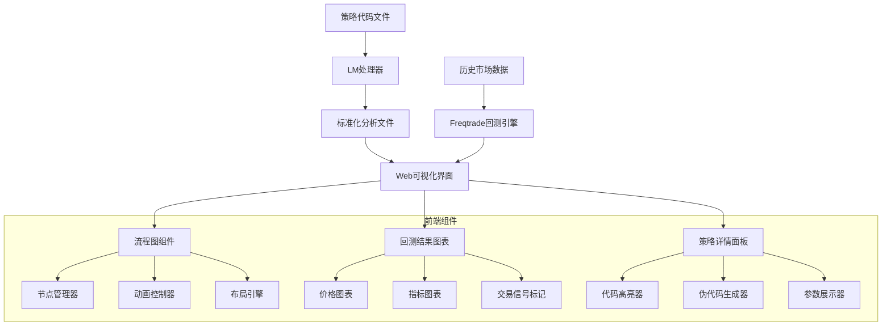

# Design Document

## Overview

本项目设计一个图形化的交互界面，用于分析和理解freqtrade交易策略的设计思路。系统采用两阶段架构：首先通过LM（Language Model）将策略代码转换为标准化的分析文件，然后通过Web界面加载和可视化这些分析结果。

系统的核心功能包括：
- 显示freqtrade完整执行流程图
- 动态展示策略执行过程
- 集成回测功能并实时可视化结果
- 提供策略接口的详细解释和伪代码

## Architecture

### 系统架构图



### 技术栈选择

基于需求中"使用现有框架减少开发量"和"尽可能使用Python"的要求，选择以下技术栈：

**主要框架：**
- **Streamlit** - Python原生的Web应用框架，代码量极少
  - 纯Python开发，无需前端知识
  - 内置丰富的UI组件
  - 支持实时数据更新和交互
  - 自动处理状态管理

**图形可视化：**
- **Plotly** - Python图形库，支持交互式图表
  - 内置流程图和网络图功能
  - 支持动态更新和动画效果
  - 可以创建类似TensorBoard的节点展开效果
  - 与Streamlit完美集成
- **Graphviz** - 备选方案，用于生成静态流程图
- **NetworkX + Plotly** - 复杂网络图可视化

**金融图表：**
- **mplfinance** - 专业的金融K线图库
- **Plotly.graph_objects** - 交互式金融图表
- **yfinance** - 获取历史市场数据（测试用）

**代码处理：**
- **ast** - Python内置，用于解析Python代码
- **Pygments** - 语法高亮库
- **openai/anthropic** - LM API调用

**数据处理：**
- **pandas** - 数据处理和分析
- **numpy** - 数值计算
- **json** - 标准化文件格式处理

**Freqtrade集成：**
- **freqtrade** - 直接导入freqtrade库进行回测
- **subprocess** - 调用freqtrade命令行工具

### 开发环境要求

**虚拟环境设置（强制要求）：**
- **强制要求使用Python虚拟环境** - 避免依赖冲突，确保项目隔离
- **Python 3.8+** - 支持现代Python特性和类型注解
- **pip** - 包管理器，用于安装项目依赖

**虚拟环境创建步骤：**
```bash
# 进入项目目录
cd strategy_visualizer

# 创建虚拟环境
python -m venv venv

# 激活虚拟环境
# Windows
venv\Scripts\activate
# Linux/Mac
source venv/bin/activate

# 升级pip
python -m pip install --upgrade pip

# 安装依赖
pip install -r requirements.txt

# 验证安装
python -c "import streamlit, plotly, networkx; print('Dependencies installed successfully')"
```

**虚拟环境管理：**
- **激活环境** - 每次开发前必须激活虚拟环境
- **依赖更新** - 新增依赖后更新requirements.txt
- **环境验证** - 定期验证依赖完整性
- **环境隔离** - 不同项目使用独立的虚拟环境

**开发工具推荐：**
- **IDE配置** - 确保IDE使用虚拟环境中的Python解释器
- **依赖管理** - 所有新依赖都应添加到requirements.txt
- **环境隔离** - 不同项目使用独立的虚拟环境
- **测试环境** - 在虚拟环境中运行所有测试

**常见问题解决：**
- **权限问题** - Windows用户可能需要以管理员身份运行
- **路径问题** - 确保Python和pip在系统PATH中
- **依赖冲突** - 使用虚拟环境避免全局依赖冲突

## Project Structure

### 完整项目目录树

```
freqtrade-strategy-visualizer/
├── README.md                       # 项目说明文档
├── .gitignore                      # Git忽略文件
└── strategy_visualizer/            # 主项目文件夹
    ├── app.py                      # 主应用入口 (50行)
    ├── requirements.txt            # Python依赖包
    ├── .streamlit/
    │   └── config.toml             # Streamlit配置
    ├── components/                 # 组件模块
    │   ├── __init__.py
    │   ├── flowchart/              # 流程图组件
    │   │   ├── __init__.py
    │   │   ├── main.py             # 主渲染函数 (25行)
    │   │   ├── graph_builder.py    # 图结构构建 (30行)
    │   │   ├── plotly_renderer.py  # Plotly渲染器 (40行)
    │   │   ├── event_handler.py    # 事件处理 (25行)
    │   │   └── node_details.py     # 节点详情显示 (30行)
    │   ├── backtest/               # 回测组件
    │   │   ├── __init__.py
    │   │   ├── main.py             # 主回测面板 (30行)
    │   │   ├── config_panel.py     # 配置面板 (25行)
    │   │   ├── executor.py         # 回测执行器 (30行)
    │   │   ├── results_renderer.py # 结果渲染器 (25行)
    │   │   ├── charts.py           # 图表组件 (40行)
    │   │   ├── metrics.py          # 性能指标 (15行)
    │   │   ├── tables.py           # 表格组件 (15行)
    │   │   ├── config_builder.py   # 配置构建器 (20行)
    │   │   └── result_parser.py    # 结果解析器 (25行)
    │   └── strategy_details/       # 策略详情组件
    │       ├── __init__.py
    │       ├── main.py             # 主详情面板 (20行)
    │       ├── interface_viewer.py # 接口查看器 (25行)
    │       └── parameter_viewer.py # 参数查看器 (20行)
    ├── utils/                      # 工具模块
    │   ├── __init__.py
    │   ├── data_models.py          # 数据模型 (50行)
    │   ├── error_handling.py       # 错误处理 (30行)
    │   ├── file_utils.py           # 文件工具 (20行)
    │   └── constants.py            # 常量定义 (15行)
    ├── prompts/                    # LM处理模板
    │   ├── strategy_analysis.yaml  # 策略分析prompt
    │   └── examples/               # 示例文件
    │       ├── sample_strategy.py  # 示例策略代码
    │       └── sample_analysis.json # 示例分析结果
    ├── tests/                      # 测试文件
    │   ├── __init__.py
    │   ├── test_strategy_analysis.py # 策略分析测试 (30行)
    │   ├── test_flowchart.py       # 流程图测试 (25行)
    │   ├── test_backtest.py        # 回测测试 (20行)
    │   └── fixtures/               # 测试数据
    │       ├── mock_strategy.json
    │       └── mock_backtest_result.json
    ├── docs/                       # 文档目录
    │   ├── user_guide.md           # 用户指南
    │   ├── api_reference.md        # API参考
    │   └── development.md          # 开发指南
    └── temp/                       # 临时文件目录
        ├── configs/                # 临时配置文件
        └── results/                # 临时结果文件
```

### 代码量统计

**总计约 600 行 Python 代码**

- **主应用**: 50行
- **流程图组件**: 150行 (6个文件)
- **回测组件**: 225行 (9个文件)  
- **策略详情组件**: 65行 (3个文件)
- **工具模块**: 115行 (4个文件)
- **测试代码**: 75行 (3个文件)

### 模块化设计优势

1. **单一职责**: 每个文件专注于特定功能，代码量控制在15-50行
2. **易于维护**: 模块化结构便于定位和修改问题
3. **可扩展性**: 新功能可以独立添加新模块
4. **测试友好**: 小模块便于编写单元测试
5. **团队协作**: 不同开发者可以并行开发不同模块

## Components and Interfaces

### 1. LM处理器组件

#### 1.1 Prompt模板定义

```yaml
# prompts/strategy_analysis.yaml
system_prompt: |
  你是一个专业的freqtrade策略分析师。请分析给定的策略代码，并按照标准格式输出分析结果。

analysis_prompt: |
  请分析以下freqtrade策略代码，提取以下信息：
  
  1. 策略基本信息（名称、作者、描述等）
  2. 所有实现的接口函数及其逻辑
  3. 技术指标和参数配置
  4. 买入/卖出条件
  5. 风险管理设置
  
  输出格式必须为JSON，包含以下字段：
  - strategy_name: 策略名称
  - description: 策略描述
  - interfaces: 接口函数列表
  - indicators: 技术指标列表
  - parameters: 参数配置
  - buy_conditions: 买入条件
  - sell_conditions: 卖出条件
  - risk_management: 风险管理设置
```

#### 1.2 标准化输出格式

```typescript
interface StrategyAnalysis {
  strategy_name: string;
  description: string;
  author?: string;
  version?: string;
  
  interfaces: {
    [key: string]: {
      implemented: boolean;
      description: string;
      pseudocode: string;
      input_params: Parameter[];
      output_description: string;
      logic_explanation: string;
    }
  };
  
  indicators: {
    name: string;
    parameters: Record<string, any>;
    description: string;
  }[];
  
  parameters: {
    roi: Record<string, number>;
    stoploss: number;
    timeframe: string;
    startup_candle_count: number;
    [key: string]: any;
  };
  
  buy_conditions: Condition[];
  sell_conditions: Condition[];
  risk_management: RiskManagement;
}

interface Parameter {
  name: string;
  type: string;
  description: string;
  example?: any;
}

interface Condition {
  description: string;
  logic: string;
  indicators_used: string[];
}

interface RiskManagement {
  stoploss_type: string;
  trailing_stop: boolean;
  custom_stoploss: boolean;
  position_sizing: string;
}
```

### 2. Streamlit应用组件

#### 2.1 主应用组件

```python
# app.py - 主应用入口（约50行代码）
import streamlit as st
import json
from pathlib import Path
from components.flowchart import render_flowchart
from components.backtest import render_backtest_panel
from components.strategy_analyzer import analyze_strategy_file
from utils.data_models import StrategyAnalysis

def main():
    st.set_page_config(
        page_title="Freqtrade策略可视化工具",
        page_icon="📈",
        layout="wide"
    )
    
    st.title("🚀 Freqtrade策略可视化分析工具")
    
    # 侧边栏 - 文件上传和配置
    with st.sidebar:
        st.header("📁 策略文件")
        uploaded_file = st.file_uploader(
            "上传策略分析文件", 
            type=['json'],
            help="请上传经过LM处理的标准化策略分析JSON文件"
        )
        
        if uploaded_file:
            strategy_data = load_strategy_file(uploaded_file)
            st.session_state.current_strategy = strategy_data
            st.success(f"已加载策略: {strategy_data.strategy_name}")
    
    # 主界面布局
    if 'current_strategy' in st.session_state:
        # 创建两列布局
        col1, col2 = st.columns([2, 1])
        
        with col1:
            st.header("📊 策略执行流程图")
            render_flowchart(st.session_state.current_strategy)
        
        with col2:
            st.header("📋 策略详情")
            render_strategy_details(st.session_state.current_strategy)
        
        # 回测面板
        st.header("🔄 回测分析")
        render_backtest_panel(st.session_state.current_strategy)
    else:
        st.info("👆 请在侧边栏上传策略分析文件开始使用")

def load_strategy_file(uploaded_file) -> StrategyAnalysis:
    """加载并验证策略文件"""
    try:
        data = json.load(uploaded_file)
        return StrategyAnalysis.from_dict(data)
    except Exception as e:
        st.error(f"文件加载失败: {str(e)}")
        return None

if __name__ == "__main__":
    main()
```

#### 2.2 流程图组件（拆分为多个小模块）

```python
# components/flowchart/__init__.py
from .main import render_flowchart

# components/flowchart/main.py (约25行代码)
import streamlit as st
from .graph_builder import create_strategy_graph
from .plotly_renderer import create_flowchart_figure
from .event_handler import handle_node_selection
from utils.data_models import StrategyAnalysis

def render_flowchart(strategy: StrategyAnalysis):
    """渲染交互式流程图"""
    # 创建网络图
    G = create_strategy_graph(strategy)
    
    # 创建Plotly图形
    fig = create_flowchart_figure(G, strategy)
    
    # 显示图形并处理交互
    selected_points = st.plotly_chart(fig, use_container_width=True, key="flowchart")
    
    # 处理节点点击事件
    if selected_points and 'selection' in selected_points:
        handle_node_selection(selected_points['selection'], strategy)

# components/flowchart/graph_builder.py (约30行代码)
import networkx as nx
from utils.data_models import StrategyAnalysis

def create_strategy_graph(strategy: StrategyAnalysis) -> nx.DiGraph:
    """创建策略流程图的网络结构"""
    G = nx.DiGraph()
    
    # 添加节点
    nodes = [
        ('data_fetch', {'label': '数据获取', 'type': 'core', 'description': '从交易所获取OHLCV数据'}),
        ('strategy_init', {'label': '策略初始化', 'type': 'core', 'description': '初始化策略参数'}),
        ('populate_indicators', {'label': 'populate_indicators', 'type': 'strategy', 
         'interface_info': strategy.interfaces.get('populate_indicators')}),
        ('populate_buy', {'label': 'populate_buy_trend', 'type': 'strategy',
         'interface_info': strategy.interfaces.get('populate_buy_trend')}),
        ('populate_sell', {'label': 'populate_sell_trend', 'type': 'strategy',
         'interface_info': strategy.interfaces.get('populate_sell_trend')}),
        ('risk_management', {'label': '风险管理', 'type': 'core', 'description': '执行风险控制'}),
        ('order_execution', {'label': '订单执行', 'type': 'core', 'description': '发送交易订单'})
    ]
    
    G.add_nodes_from(nodes)
    
    # 添加边
    edges = [
        ('data_fetch', 'strategy_init'),
        ('strategy_init', 'populate_indicators'),
        ('populate_indicators', 'populate_buy'),
        ('populate_indicators', 'populate_sell'),
        ('populate_buy', 'risk_management'),
        ('populate_sell', 'risk_management'),
        ('risk_management', 'order_execution')
    ]
    
    G.add_edges_from(edges)
    return G

# components/flowchart/plotly_renderer.py (约40行代码)
import plotly.graph_objects as go
import networkx as nx
from typing import Dict
from utils.data_models import StrategyAnalysis

def create_flowchart_figure(G: nx.DiGraph, strategy: StrategyAnalysis) -> go.Figure:
    """创建Plotly流程图"""
    # 生成布局
    pos = nx.spring_layout(G, k=3, iterations=50)
    
    # 创建节点和边的数据
    node_trace, edge_trace = create_plotly_traces(G, pos)
    
    # 创建图形
    fig = go.Figure(
        data=[edge_trace, node_trace],
        layout=create_layout()
    )
    
    return fig

def create_plotly_traces(G: nx.DiGraph, pos: Dict):
    """创建Plotly图形的轨迹数据"""
    # 边的轨迹
    edge_x, edge_y = [], []
    for edge in G.edges():
        x0, y0 = pos[edge[0]]
        x1, y1 = pos[edge[1]]
        edge_x.extend([x0, x1, None])
        edge_y.extend([y0, y1, None])
    
    edge_trace = go.Scatter(
        x=edge_x, y=edge_y,
        line=dict(width=2, color='#888'),
        hoverinfo='none',
        mode='lines'
    )
    
    # 节点的轨迹
    node_x, node_y, node_text, node_color = [], [], [], []
    for node in G.nodes():
        x, y = pos[node]
        node_x.append(x)
        node_y.append(y)
        
        node_info = G.nodes[node]
        node_text.append(node_info['label'])
        
        # 根据节点类型设置颜色
        if node_info['type'] == 'strategy':
            node_color.append('#4CAF50')  # 绿色 - 策略接口
        else:
            node_color.append('#2196F3')  # 蓝色 - 核心流程
    
    node_trace = go.Scatter(
        x=node_x, y=node_y,
        mode='markers+text',
        text=node_text,
        textposition="middle center",
        hoverinfo='text',
        marker=dict(size=50, color=node_color, line=dict(width=2, color='white'))
    )
    
    return node_trace, edge_trace

def create_layout() -> go.Layout:
    """创建图形布局"""
    return go.Layout(
        title="Freqtrade策略执行流程图",
        titlefont_size=16,
        showlegend=False,
        hovermode='closest',
        margin=dict(b=20,l=5,r=5,t=40),
        annotations=[dict(
            text="点击节点查看详细信息",
            showarrow=False,
            xref="paper", yref="paper",
            x=0.005, y=-0.002,
            xanchor='left', yanchor='bottom',
            font=dict(color="#888", size=12)
        )],
        xaxis=dict(showgrid=False, zeroline=False, showticklabels=False),
        yaxis=dict(showgrid=False, zeroline=False, showticklabels=False),
        height=600
    )

# components/flowchart/event_handler.py (约25行代码)
import streamlit as st
from typing import Dict
from utils.data_models import StrategyAnalysis
from .node_details import show_node_details

def handle_node_selection(selection: Dict, strategy: StrategyAnalysis):
    """处理节点选择事件"""
    if not selection.get('points'):
        return
    
    # 获取选中的节点信息
    point = selection['points'][0]
    node_index = point.get('pointIndex')
    
    if node_index is not None:
        # 显示节点详细信息
        show_node_details(node_index, strategy)

# components/flowchart/node_details.py (约30行代码)
import streamlit as st
from utils.data_models import StrategyAnalysis

def show_node_details(node_index: int, strategy: StrategyAnalysis):
    """显示节点详细信息"""
    node_names = ['data_fetch', 'strategy_init', 'populate_indicators', 
                  'populate_buy', 'populate_sell', 'risk_management', 'order_execution']
    
    if node_index < len(node_names):
        node_name = node_names[node_index]
        
        with st.expander(f"📋 {node_name} 详细信息", expanded=True):
            if node_name in ['populate_indicators', 'populate_buy', 'populate_sell']:
                show_strategy_interface_details(node_name, strategy)
            else:
                show_core_node_details(node_name)

def show_strategy_interface_details(node_name: str, strategy: StrategyAnalysis):
    """显示策略接口节点详情"""
    interface_info = strategy.interfaces.get(node_name)
    if interface_info:
        st.write("**描述:**", interface_info.get('description', '无描述'))
        
        if interface_info.get('pseudocode'):
            st.write("**伪代码:**")
            st.code(interface_info['pseudocode'], language='python')
        
        if interface_info.get('input_params'):
            st.write("**输入参数:**")
            for param in interface_info['input_params']:
                st.write(f"- **{param['name']}** ({param['type']}): {param['description']}")
    else:
        st.write("该接口未在当前策略中实现")

def show_core_node_details(node_name: str):
    """显示核心流程节点详情"""
    descriptions = {
        'data_fetch': '从交易所获取OHLCV历史数据和实时数据',
        'strategy_init': '初始化策略参数、ROI设置、止损设置等',
        'risk_management': '执行止损检查、仓位管理、风险控制',
        'order_execution': '向交易所发送买入/卖出订单并跟踪执行状态'
    }
    st.write(descriptions.get(node_name, '核心流程节点'))
```

#### 2.3 TensorBoard风格的样式设计

```css
/* src/components/Flowchart/FlowchartPanel.css */
.flowchart-container {
  width: 100%;
  height: 100%;
  background: #f8f9fa;
}

.custom-node {
  background: white;
  border: 2px solid #e1e5e9;
  border-radius: 8px;
  box-shadow: 0 2px 8px rgba(0,0,0,0.1);
  min-width: 200px;
  font-family: 'Roboto', sans-serif;
  transition: all 0.3s ease;
}

.custom-node:hover {
  box-shadow: 0 4px 16px rgba(0,0,0,0.15);
  transform: translateY(-2px);
}

.custom-node.executing {
  border-color: #ff9800;
  box-shadow: 0 0 20px rgba(255, 152, 0, 0.3);
  animation: pulse 2s infinite;
}

@keyframes pulse {
  0% { box-shadow: 0 0 20px rgba(255, 152, 0, 0.3); }
  50% { box-shadow: 0 0 30px rgba(255, 152, 0, 0.6); }
  100% { box-shadow: 0 0 20px rgba(255, 152, 0, 0.3); }
}

.strategy-node {
  border-color: #4caf50;
}

.core-node {
  border-color: #2196f3;
}

.node-header {
  display: flex;
  justify-content: space-between;
  align-items: center;
  padding: 12px 16px;
  background: #f5f5f5;
  border-bottom: 1px solid #e1e5e9;
  cursor: pointer;
}

.node-title {
  display: flex;
  align-items: center;
  font-weight: 600;
  font-size: 14px;
}

.expand-icon {
  margin-right: 8px;
  font-size: 12px;
  transition: transform 0.2s ease;
}

.execution-indicator {
  width: 12px;
  height: 12px;
  background: #ff9800;
  border-radius: 50%;
  animation: blink 1s infinite;
}

@keyframes blink {
  0%, 50% { opacity: 1; }
  51%, 100% { opacity: 0.3; }
}

.node-content {
  padding: 16px;
}

.node-description {
  color: #666;
  font-size: 13px;
  margin-bottom: 12px;
  line-height: 1.4;
}

.node-actions {
  margin-bottom: 12px;
}

.details-btn {
  background: #e3f2fd;
  border: 1px solid #2196f3;
  color: #2196f3;
  padding: 6px 12px;
  border-radius: 4px;
  font-size: 12px;
  cursor: pointer;
  transition: all 0.2s ease;
}

.details-btn:hover {
  background: #2196f3;
  color: white;
}

.node-details {
  background: #fafafa;
  border: 1px solid #e1e5e9;
  border-radius: 4px;
  padding: 12px;
  margin-top: 8px;
}

.pseudocode-section h4,
.params-section h4,
.execution-data-section h4 {
  margin: 0 0 8px 0;
  font-size: 13px;
  color: #333;
}

.pseudocode {
  background: #f5f5f5;
  border: 1px solid #ddd;
  border-radius: 4px;
  padding: 8px;
  font-size: 12px;
  font-family: 'Monaco', 'Menlo', monospace;
  overflow-x: auto;
  white-space: pre-wrap;
}

.params-section ul {
  margin: 0;
  padding-left: 16px;
  font-size: 12px;
}

.params-section li {
  margin-bottom: 4px;
}

.data-preview {
  max-height: 200px;
  overflow-y: auto;
}

.data-preview pre {
  background: #f5f5f5;
  border: 1px solid #ddd;
  border-radius: 4px;
  padding: 8px;
  font-size: 11px;
  font-family: 'Monaco', 'Menlo', monospace;
}
```
```

#### 2.3 回测组件（拆分为多个小模块）

```python
# components/backtest/__init__.py
from .main import render_backtest_panel

# components/backtest/main.py (约30行代码)
import streamlit as st
from .config_panel import render_backtest_config
from .executor import execute_backtest
from .results_renderer import render_backtest_results
from utils.data_models import StrategyAnalysis

def render_backtest_panel(strategy: StrategyAnalysis):
    """渲染回测面板"""
    # 回测配置
    config = render_backtest_config()
    
    # 启动回测按钮
    if st.button("🚀 开始回测", type="primary"):
        with st.spinner("正在执行回测..."):
            backtest_result = execute_backtest(strategy, config)
            
            if backtest_result:
                st.session_state.backtest_result = backtest_result
                st.success("回测完成！")
    
    # 显示回测结果
    if 'backtest_result' in st.session_state:
        render_backtest_results(st.session_state.backtest_result)

# components/backtest/config_panel.py (约25行代码)
import streamlit as st
from datetime import datetime, timedelta

def render_backtest_config() -> dict:
    """渲染回测配置面板"""
    with st.expander("⚙️ 回测配置", expanded=True):
        col1, col2, col3 = st.columns(3)
        
        with col1:
            start_date = st.date_input("开始日期", datetime.now() - timedelta(days=30))
            timeframe = st.selectbox("时间框架", ["1m", "5m", "15m", "1h", "4h", "1d"])
        
        with col2:
            end_date = st.date_input("结束日期", datetime.now())
            pair = st.text_input("交易对", "BTC/USDT")
        
        with col3:
            initial_balance = st.number_input("初始资金", value=1000.0)
            max_open_trades = st.number_input("最大持仓", value=3)
    
    return {
        'start_date': start_date,
        'end_date': end_date,
        'timeframe': timeframe,
        'pair': pair,
        'initial_balance': initial_balance,
        'max_open_trades': max_open_trades
    }

# components/backtest/executor.py (约30行代码)
import streamlit as st
import subprocess
from utils.data_models import StrategyAnalysis, BacktestResult
from .config_builder import create_backtest_config
from .result_parser import parse_backtest_results

def execute_backtest(strategy: StrategyAnalysis, config: dict) -> BacktestResult:
    """执行freqtrade回测"""
    try:
        # 创建临时配置文件
        backtest_config = create_backtest_config(strategy, config)
        
        # 调用freqtrade回测
        cmd = [
            "freqtrade", "backtesting",
            "--config", "temp_config.json",
            "--strategy", strategy.strategy_name,
            "--timeframe", config['timeframe'],
            "--timerange", f"{config['start_date'].strftime('%Y%m%d')}-{config['end_date'].strftime('%Y%m%d')}"
        ]
        
        result = subprocess.run(cmd, capture_output=True, text=True)
        
        if result.returncode == 0:
            return parse_backtest_results(result.stdout, config)
        else:
            st.error(f"回测失败: {result.stderr}")
            return None
            
    except Exception as e:
        st.error(f"回测执行错误: {str(e)}")
        return None

# components/backtest/results_renderer.py (约25行代码)
import streamlit as st
from utils.data_models import BacktestResult
from .charts import render_price_chart, render_performance_chart
from .metrics import render_performance_metrics
from .tables import render_trades_table

def render_backtest_results(result: BacktestResult):
    """渲染回测结果"""
    # 性能指标
    st.subheader("📊 性能指标")
    render_performance_metrics(result)
    
    # 价格图表和交易信号
    st.subheader("📈 价格走势与交易信号")
    render_price_chart(result)
    
    # 收益曲线
    st.subheader("💰 收益曲线")
    render_performance_chart(result)
    
    # 交易详情
    st.subheader("📋 交易详情")
    render_trades_table(result)

# components/backtest/charts.py (约40行代码)
import streamlit as st
import plotly.graph_objects as go
import pandas as pd
from utils.data_models import BacktestResult

def render_price_chart(result: BacktestResult):
    """渲染价格图表"""
    fig = go.Figure()
    
    # K线图
    fig.add_trace(go.Candlestick(
        x=result.price_data['timestamp'],
        open=result.price_data['open'],
        high=result.price_data['high'],
        low=result.price_data['low'],
        close=result.price_data['close'],
        name="价格"
    ))
    
    # 买入信号
    buy_trades = [t for t in result.trades if t['side'] == 'buy']
    if buy_trades:
        fig.add_trace(go.Scatter(
            x=[t['timestamp'] for t in buy_trades],
            y=[t['price'] for t in buy_trades],
            mode='markers',
            marker=dict(color='green', size=10, symbol='triangle-up'),
            name='买入'
        ))
    
    # 卖出信号
    sell_trades = [t for t in result.trades if t['side'] == 'sell']
    if sell_trades:
        fig.add_trace(go.Scatter(
            x=[t['timestamp'] for t in sell_trades],
            y=[t['price'] for t in sell_trades],
            mode='markers',
            marker=dict(color='red', size=10, symbol='triangle-down'),
            name='卖出'
        ))
    
    fig.update_layout(
        title="价格走势与交易信号",
        xaxis_title="时间",
        yaxis_title="价格",
        height=500
    )
    
    st.plotly_chart(fig, use_container_width=True)

def render_performance_chart(result: BacktestResult):
    """渲染收益曲线"""
    df = pd.DataFrame(result.trades)
    df['cumulative_profit'] = df['profit'].cumsum()
    
    fig = go.Figure()
    fig.add_trace(go.Scatter(
        x=df['timestamp'],
        y=df['cumulative_profit'],
        mode='lines',
        name='累计收益',
        line=dict(color='blue', width=2)
    ))
    
    fig.update_layout(
        title="累计收益曲线",
        xaxis_title="时间",
        yaxis_title="收益",
        height=400
    )
    
    st.plotly_chart(fig, use_container_width=True)

# components/backtest/metrics.py (约15行代码)
import streamlit as st
from utils.data_models import BacktestResult

def render_performance_metrics(result: BacktestResult):
    """渲染性能指标"""
    col1, col2, col3, col4 = st.columns(4)
    
    with col1:
        st.metric("总收益率", f"{result.performance['total_return']:.2%}")
    with col2:
        st.metric("最大回撤", f"{result.performance['max_drawdown']:.2%}")
    with col3:
        st.metric("胜率", f"{result.performance['win_rate']:.2%}")
    with col4:
        st.metric("交易次数", result.performance['total_trades'])

# components/backtest/tables.py (约15行代码)
import streamlit as st
import pandas as pd
from utils.data_models import BacktestResult

def render_trades_table(result: BacktestResult):
    """渲染交易表格"""
    df = pd.DataFrame(result.trades)
    if not df.empty:
        df['profit_pct'] = (df['profit'] / df['amount'] * 100).round(2)
        st.dataframe(
            df[['timestamp', 'pair', 'side', 'price', 'amount', 'profit', 'profit_pct', 'reason']],
            use_container_width=True
        )
    else:
        st.info("没有交易记录")
```

## Data Models

### Python数据模型（约50行代码）

```python
# utils/data_models.py
from dataclasses import dataclass, field
from typing import Dict, List, Optional, Any, Union
from datetime import datetime
from enum import Enum

class NodeType(Enum):
    FREQTRADE_CORE = "freqtrade_core"
    STRATEGY_INTERFACE = "strategy_interface"
    DECISION = "decision"
    DATA_FLOW = "data_flow"

class ExecutionMode(Enum):
    IDLE = "idle"
    SIMULATION = "simulation"
    BACKTEST = "backtest"

@dataclass
class Parameter:
    name: str
    type: str
    description: str
    example: Optional[Any] = None

@dataclass
class InterfaceImplementation:
    implemented: bool
    description: str
    pseudocode: str
    input_params: List[Parameter]
    output_description: str
    logic_explanation: str

@dataclass
class StrategyAnalysis:
    strategy_name: str
    description: str
    interfaces: Dict[str, InterfaceImplementation]
    indicators: List[Dict[str, Any]]
    parameters: Dict[str, Any]
    buy_conditions: List[Dict[str, Any]]
    sell_conditions: List[Dict[str, Any]]
    risk_management: Dict[str, Any]
    author: Optional[str] = None
    version: Optional[str] = None
    
    @classmethod
    def from_dict(cls, data: Dict[str, Any]) -> 'StrategyAnalysis':
        """从字典创建StrategyAnalysis对象"""
        interfaces = {}
        for key, value in data.get('interfaces', {}).items():
            interfaces[key] = InterfaceImplementation(
                implemented=value.get('implemented', False),
                description=value.get('description', ''),
                pseudocode=value.get('pseudocode', ''),
                input_params=[Parameter(**p) for p in value.get('input_params', [])],
                output_description=value.get('output_description', ''),
                logic_explanation=value.get('logic_explanation', '')
            )
        
        return cls(
            strategy_name=data['strategy_name'],
            description=data.get('description', ''),
            interfaces=interfaces,
            indicators=data.get('indicators', []),
            parameters=data.get('parameters', {}),
            buy_conditions=data.get('buy_conditions', []),
            sell_conditions=data.get('sell_conditions', []),
            risk_management=data.get('risk_management', {}),
            author=data.get('author'),
            version=data.get('version')
        )

@dataclass
class Trade:
    id: str
    pair: str
    side: str  # 'buy' or 'sell'
    timestamp: datetime
    price: float
    amount: float
    profit: Optional[float] = None
    reason: str = ""

@dataclass
class BacktestResult:
    strategy_name: str
    timeframe: str
    start_date: datetime
    end_date: datetime
    price_data: Dict[str, List[Any]]  # OHLCV数据
    trades: List[Dict[str, Any]]
    performance: Dict[str, float]
    indicators: Dict[str, List[float]] = field(default_factory=dict)

@dataclass
class ExecutionStep:
    step_id: str
    node_id: str
    timestamp: datetime
    input_data: Any
    output_data: Any
    execution_time_ms: int
    status: str  # 'success' or 'error'

@dataclass
class ExecutionState:
    mode: ExecutionMode
    current_step: str
    execution_history: List[ExecutionStep] = field(default_factory=list)
    current_timestamp: Optional[datetime] = None
    backtest_progress: Optional[Dict[str, Any]] = None
```

## Error Handling

### Python错误处理（约30行代码）

```python
# utils/error_handling.py
import streamlit as st
import json
from typing import Any, Dict

class FileLoadError(Exception):
    """文件加载错误"""
    def __init__(self, message: str, filename: str):
        self.message = message
        self.filename = filename
        super().__init__(f"{message}: {filename}")

class BacktestError(Exception):
    """回测执行错误"""
    def __init__(self, message: str, code: str = "UNKNOWN"):
        self.message = message
        self.code = code
        super().__init__(message)

def handle_file_load(uploaded_file) -> Dict[str, Any]:
    """安全地加载和验证策略文件"""
    try:
        content = json.load(uploaded_file)
        validate_strategy_analysis(content)
        return content
    except json.JSONDecodeError:
        raise FileLoadError("文件格式不正确，请确保是有效的JSON文件", uploaded_file.name)
    except KeyError as e:
        raise FileLoadError(f"缺少必要字段: {str(e)}", uploaded_file.name)
    except Exception as e:
        raise FileLoadError(f"文件加载失败: {str(e)}", uploaded_file.name)

def validate_strategy_analysis(data: Dict[str, Any]) -> None:
    """验证策略分析数据格式"""
    required_fields = ['strategy_name', 'interfaces', 'parameters']
    for field in required_fields:
        if field not in data:
            raise KeyError(field)

def handle_backtest_error(error: Exception) -> BacktestError:
    """处理回测执行错误"""
    error_msg = str(error)
    
    if "strategy" in error_msg.lower() and "not found" in error_msg.lower():
        return BacktestError("策略文件未找到或无效", "INVALID_STRATEGY")
    elif "data" in error_msg.lower() and ("not found" in error_msg.lower() or "insufficient" in error_msg.lower()):
        return BacktestError("历史数据不足或无法获取", "DATA_NOT_FOUND")
    elif "permission" in error_msg.lower():
        return BacktestError("权限不足，无法执行回测", "PERMISSION_ERROR")
    else:
        return BacktestError(f"回测执行失败: {error_msg}", "EXECUTION_ERROR")

def safe_execute(func, error_message: str = "操作失败"):
    """安全执行函数并处理错误"""
    try:
        return func()
    except Exception as e:
        st.error(f"{error_message}: {str(e)}")
        return None
```

## Testing Strategy

### Python测试策略（约40行代码）

```python
# tests/test_strategy_analysis.py
import pytest
import json
from utils.data_models import StrategyAnalysis
from utils.error_handling import FileLoadError

def test_strategy_analysis_parsing():
    """测试策略分析文件解析"""
    mock_data = {
        'strategy_name': 'TestStrategy',
        'description': 'Test strategy',
        'interfaces': {
            'populate_indicators': {
                'implemented': True,
                'description': 'Test description',
                'pseudocode': 'test code',
                'input_params': [],
                'output_description': 'test output',
                'logic_explanation': 'test logic'
            }
        },
        'indicators': [],
        'parameters': {'roi': {'0': 0.1}},
        'buy_conditions': [],
        'sell_conditions': [],
        'risk_management': {}
    }
    
    strategy = StrategyAnalysis.from_dict(mock_data)
    assert strategy.strategy_name == 'TestStrategy'
    assert 'populate_indicators' in strategy.interfaces

def test_invalid_file_format():
    """测试无效文件格式处理"""
    invalid_data = {'invalid': 'data'}
    
    with pytest.raises(KeyError):
        StrategyAnalysis.from_dict(invalid_data)

# tests/test_flowchart.py
import pytest
from components.flowchart import create_strategy_graph
from utils.data_models import StrategyAnalysis

def test_flowchart_generation():
    """测试流程图生成"""
    mock_strategy = create_mock_strategy()
    graph = create_strategy_graph(mock_strategy)
    
    assert len(graph.nodes()) > 0
    assert 'populate_indicators' in graph.nodes()
    assert 'data_fetch' in graph.nodes()

def create_mock_strategy():
    """创建模拟策略对象"""
    return StrategyAnalysis(
        strategy_name='MockStrategy',
        description='Mock strategy for testing',
        interfaces={},
        indicators=[],
        parameters={},
        buy_conditions=[],
        sell_conditions=[],
        risk_management={}
    )

# tests/test_backtest.py
import pytest
from unittest.mock import patch, MagicMock
from components.backtest import execute_backtest

@patch('subprocess.run')
def test_backtest_execution(mock_subprocess):
    """测试回测执行"""
    mock_subprocess.return_value = MagicMock(
        returncode=0,
        stdout='{"trades": [], "performance": {"total_return": 0.1}}'
    )
    
    strategy = create_mock_strategy()
    config = {
        'start_date': '2023-01-01',
        'end_date': '2023-12-31',
        'timeframe': '1h',
        'pair': 'BTC/USDT'
    }
    
    # 注意：这里需要实际实现execute_backtest函数
    # result = execute_backtest(strategy, config)
    # assert result is not None
```

## Performance Considerations

### 1. 大数据集处理

- 使用虚拟滚动处理大量历史数据
- 实现数据分页和懒加载
- 使用Web Workers处理计算密集型任务

### 2. 图形渲染优化

- 使用Canvas渲染大量数据点
- 实现视口裁剪，只渲染可见区域
- 使用requestAnimationFrame优化动画

### 3. 内存管理

- 及时清理不需要的数据引用
- 使用对象池复用频繁创建的对象
- 监控内存使用情况并提供警告

## Security Considerations

### 1. 文件上传安全

- 限制文件类型和大小
- 验证文件内容格式
- 使用沙箱环境处理用户文件

### 2. 数据验证

- 严格验证所有输入数据
- 防止XSS攻击
- 使用TypeScript提供类型安全

### 3. API安全

- 实现请求频率限制
- 验证所有API请求参数
- 使用HTTPS传输敏感数据